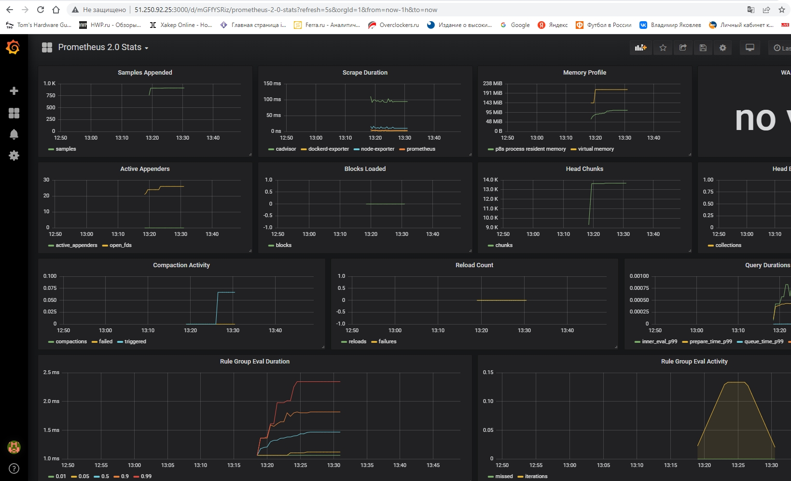

# "5.5. Оркестрация кластером Docker контейнеров на примере Docker Swarm" dev-17_virt5-yakovlev_vs

## Задача 1

Дайте письменые ответы на следующие вопросы:

- В чём отличие режимов работы сервисов в Docker Swarm кластере: replication и global?
- Какой алгоритм выбора лидера используется в Docker Swarm кластере?
- Что такое Overlay Network?

#### Решение

1) В чём отличие режимов работы сервисов в Docker Swarm кластере: replication и global?
- В режиме replication мы явно указываем количество реплик сервиса, которые хотим запустить. 
В режиме global запускается одна реплика на каждом узле, заранее заданного количества реплик нет.

2) Какой алгоритм выбора лидера используется в Docker Swarm кластере?
- В Docker Swarm кластере используется так называемый алгоритм поддержания распределенного консенсуса — Raft. 
Выбор лидера происходит следующим образом: если ноды-фолловеры не слышат лидера, 
они переходят в статус кандидата, кандидат на лидера отправляет остальным нодам запрос на голосование и, 
большинством голосов, выбирается лидером.

3) Что такое Overlay Network?
- Overlay-сети используются в контексте кластеров (Docker Swarm), где виртуальная сеть, которую используют контейнеры, 
связывает несколько физических хостов, на которых запущен Docker. Overlay-сеть создает подсеть, которую могут использовать контейнеры в разных хостах swarm-кластера. 
Контейнеры на разных физических хостах могут обмениваться данными по overlay-сети (если все они прикреплены к одной сети)

## Задача 2

Создать ваш первый Docker Swarm кластер в Яндекс.Облаке

Для получения зачета, вам необходимо предоставить скриншот из терминала (консоли), с выводом команды:
```
docker node ls
```
#### Решение

```bash
Apply complete! Resources: 13 added, 0 changed, 0 destroyed.

Outputs:

external_ip_address_node01 = "51.250.92.25"
external_ip_address_node02 = "62.84.119.108"
external_ip_address_node03 = "62.84.118.197"
external_ip_address_node04 = "51.250.83.177"
external_ip_address_node05 = "62.84.117.60"
external_ip_address_node06 = "62.84.117.52"
internal_ip_address_node01 = "192.168.101.11"
internal_ip_address_node02 = "192.168.101.12"
internal_ip_address_node03 = "192.168.101.13"
internal_ip_address_node04 = "192.168.101.14"
internal_ip_address_node05 = "192.168.101.15"
internal_ip_address_node06 = "192.168.101.16"
root@server1:~/src2/terraform# ssh centos@51.250.92.25
[centos@node01 ~]$ sudo -i
[root@node01 ~]# docker node ls
ID                            HOSTNAME             STATUS    AVAILABILITY   MANAGER STATUS   ENGINE VERSION
cg8gr9umoijcs7ea4j3sznvlh *   node01.netology.yc   Ready     Active         Leader           20.10.17
obndjcson5gpt40j07p43rjk6     node02.netology.yc   Ready     Active         Reachable        20.10.17
s6k1zse6pu7mtbaw0chvksxjq     node03.netology.yc   Ready     Active         Reachable        20.10.17
svdyr92k9cnq15s4h83la1tk4     node04.netology.yc   Ready     Active                          20.10.17
3zez7zxat2g8r7c9ve249ok0u     node05.netology.yc   Ready     Active                          20.10.17
oo9vbk8au80xrqw5wj7r0anzx     node06.netology.yc   Ready     Active                          20.10.17
```

## Задача 3

Создать ваш первый, готовый к боевой эксплуатации кластер мониторинга, состоящий из стека микросервисов.

Для получения зачета, вам необходимо предоставить скриншот из терминала (консоли), с выводом команды:
```
docker service ls
```
#### Решение

```bash
[centos@node01 ~]$ sudo -i
[root@node01 ~]# docker service ls
ID             NAME                                MODE         REPLICAS   IMAGE                                          PORTS
kb6433dd6na5   swarm_monitoring_alertmanager       replicated   1/1        stefanprodan/swarmprom-alertmanager:v0.14.0
2v6s7qc8sy3n   swarm_monitoring_caddy              replicated   1/1        stefanprodan/caddy:latest                      *:3000->3000/tcp, *:9090->9090/tcp, *:9093-9094->9093-9094/tcp
iqebzbq7g536   swarm_monitoring_cadvisor           global       6/6        google/cadvisor:latest
ve5ttilmfh7c   swarm_monitoring_dockerd-exporter   global       6/6        stefanprodan/caddy:latest
k091jb16o7su   swarm_monitoring_grafana            replicated   1/1        stefanprodan/swarmprom-grafana:5.3.4
6vidr9kxwyr4   swarm_monitoring_node-exporter      global       6/6        stefanprodan/swarmprom-node-exporter:v0.16.0
rtpitcb3bion   swarm_monitoring_prometheus         replicated   1/1        stefanprodan/swarmprom-prometheus:v2.5.0
dlpav8yo9mqv   swarm_monitoring_unsee              replicated   1/1        cloudflare/unsee:v0.8.0
```



## Задача 4 (*)

Выполнить на лидере Docker Swarm кластера команду (указанную ниже) и дать письменное описание её функционала, что она делает и зачем она нужна:
```
# см.документацию: https://docs.docker.com/engine/swarm/swarm_manager_locking/
docker swarm update --autolock=true
```
#### Решение

--autolock=true обязывает вводить ключ разблокировки на ноде, чтобы она могла заново присоединиться к кластеру, если была перезапущена. Ввод ключа позволит расшифровать лог Raft и загрузить все "секреты" в память ноды (логины, пароли, TLS ключи, SSH ключи и т.д.)
Например для защиты кластера от несанкционированного доступа к файлам ноды.

```bash
[root@node01 ~]# docker swarm update --autolock=true
Swarm updated.
To unlock a swarm manager after it restarts, run the `docker swarm unlock`
command and provide the following key:

    SWMKEY-1-9AwUwQdrXVsjY4MRXH1LsZYZfWXccdR6sqq2tdMwEqY

Please remember to store this key in a password manager, since without it you
will not be able to restart the manager.
[root@node01 ~]# ^C
[root@node01 ~]# service docker restart
Redirecting to /bin/systemctl restart docker.service
[root@node01 ~]# docker node ls
Error response from daemon: Swarm is encrypted and needs to be unlocked before it can be used. Please use "docker swarm unlock" to unlock it.
[root@node01 ~]# docker swarm unlock
Please enter unlock key:
[root@node01 ~]# docker node ls
ID                            HOSTNAME             STATUS    AVAILABILITY   MANAGER STATUS   ENGINE VERSION
cg8gr9umoijcs7ea4j3sznvlh *   node01.netology.yc   Ready     Active         Reachable        20.10.17
obndjcson5gpt40j07p43rjk6     node02.netology.yc   Ready     Active         Reachable        20.10.17
s6k1zse6pu7mtbaw0chvksxjq     node03.netology.yc   Ready     Active         Leader           20.10.17
svdyr92k9cnq15s4h83la1tk4     node04.netology.yc   Ready     Active                          20.10.17
3zez7zxat2g8r7c9ve249ok0u     node05.netology.yc   Ready     Active                          20.10.17
oo9vbk8au80xrqw5wj7r0anzx     node06.netology.yc   Ready     Active                          20.10.17
```